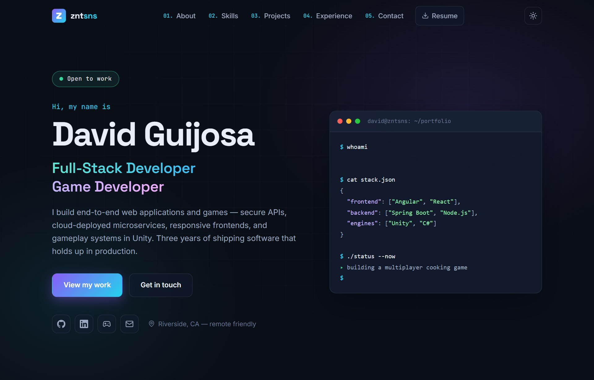
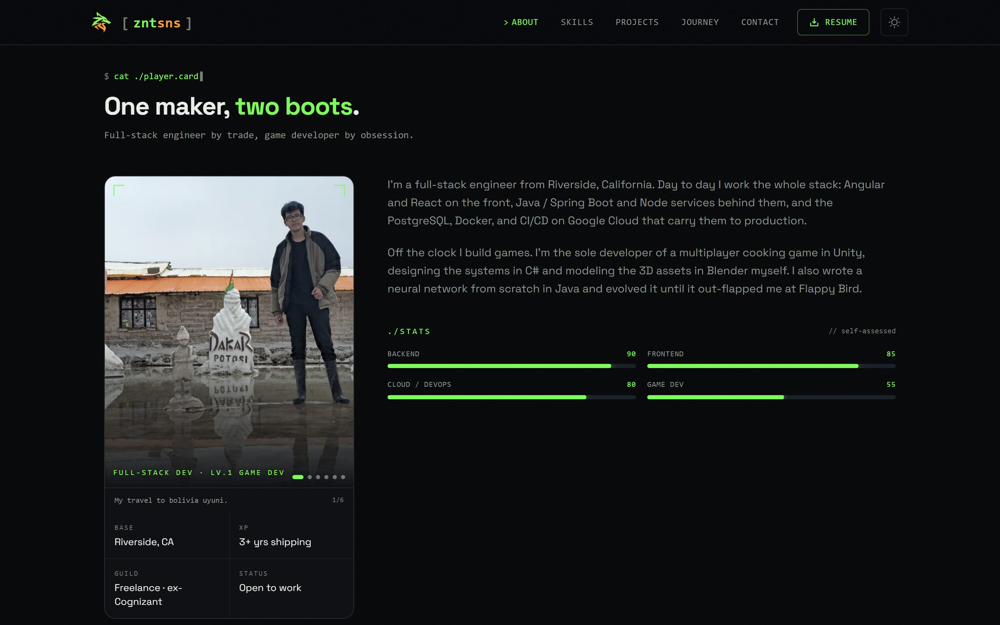
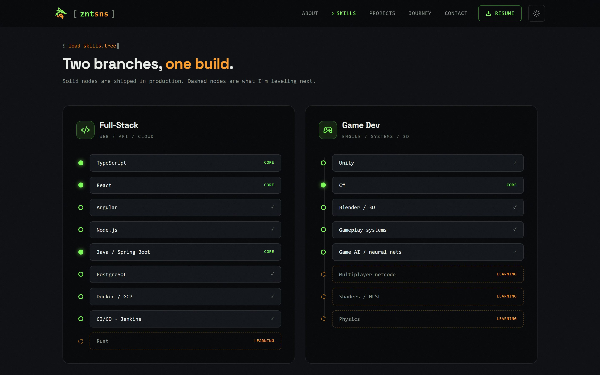
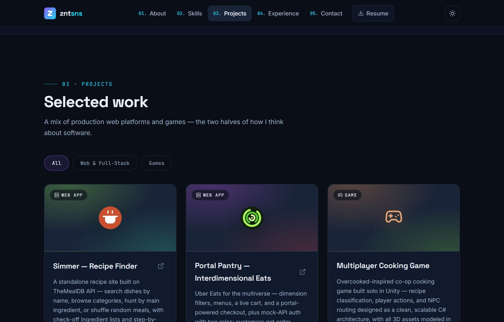
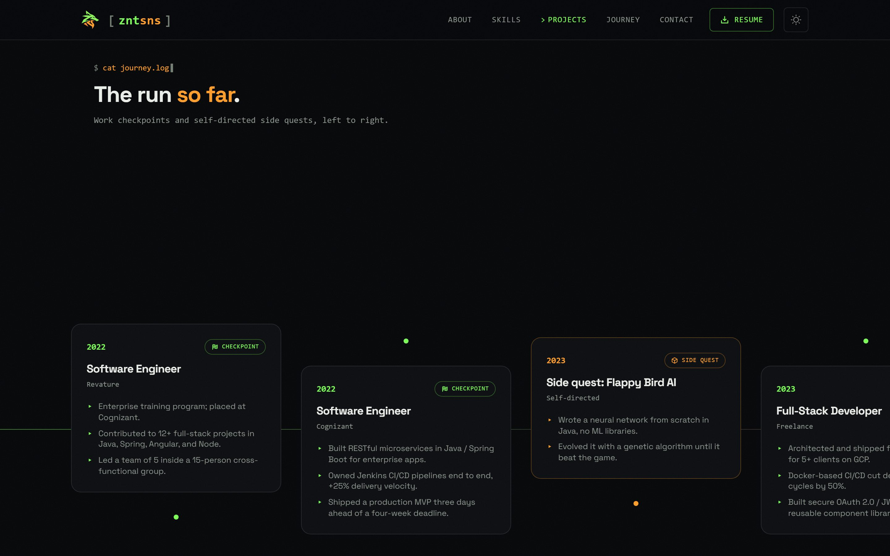
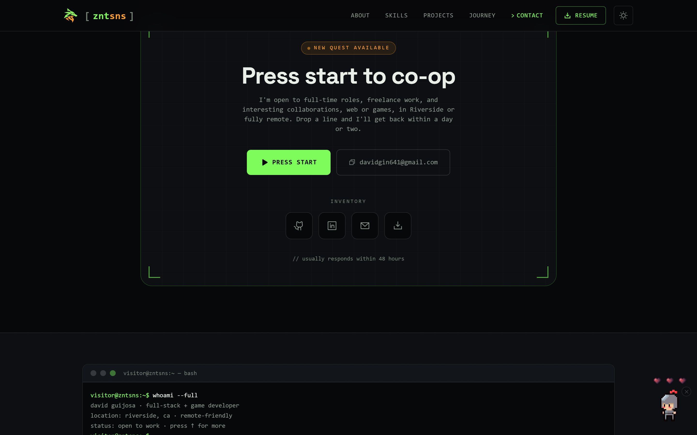
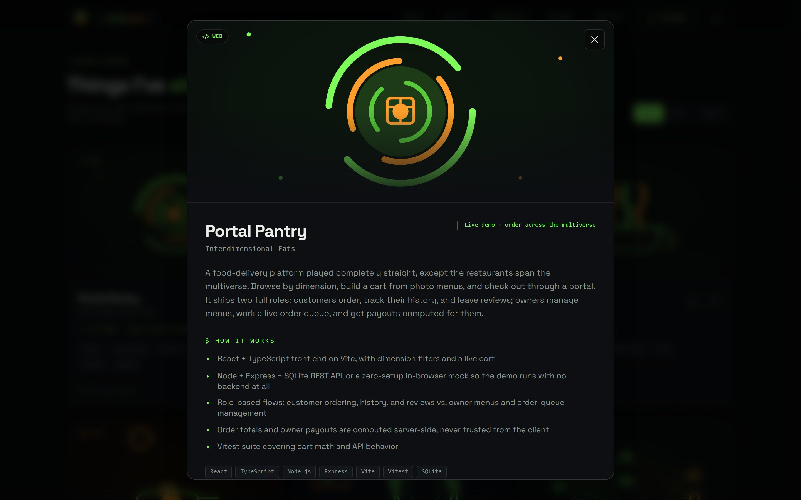
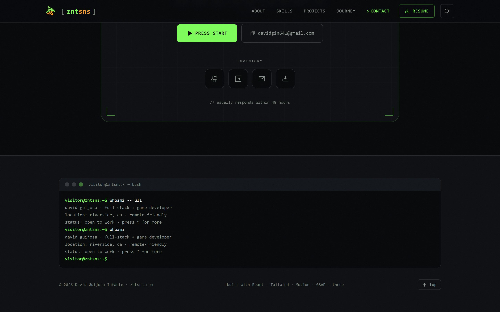
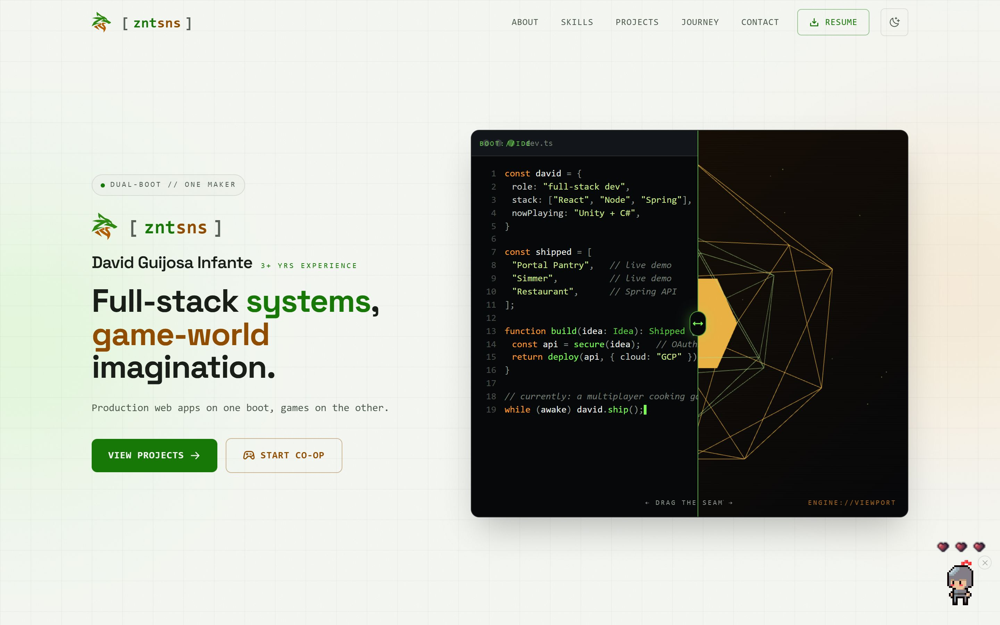

<div align="center">

# David Guijosa — Portfolio

**A dual-boot machine: full-stack engineer on one side, game developer on the other.**

[](https://react.dev)
[](https://www.typescriptlang.org)
[](https://vite.dev)
[](https://tailwindcss.com)
[](https://gsap.com)
[](https://threejs.org)

[Live site](https://www.zntsns.com) · [LinkedIn](https://www.linkedin.com/in/davidguijosa/) · [GitHub](https://github.com/Davidzent)

</div>



The portfolio app of the [ZNTSNS workspace](../../README.md), served at the root of
[zntsns.com](https://www.zntsns.com). It's a single-page site built around one idea:
the wordmark **znt·sns** splits into two halves — `znt` in acid green is the IDE, `sns`
in amber is the game engine — and the whole page is that seam.

In the hero, the seam is literal. A live-typing `dev.ts` editor is clipped over a WebGL
viewport, and you can drag the divider between them.

---

## Sections

Every section is the same résumé beat told in the site's own vocabulary.

| | |
|---|---|
| **About** — a player card: rotating travel gallery, bio, and self-assessed stat bars. |  |
| **Skills** — a two-branch tree. Solid nodes ship in production, dashed nodes are what's being levelled next. |  |
| **Projects** — a level select. Filter by web / games; each card has its own animated SVG mark. |  |
| **Journey** — a GSAP-pinned horizontal timeline of work checkpoints and self-directed side quests. |  |
| **Contact** — a quest board: press start, copy the email, or grab the résumé. |  |

## Signature interactions

**Project briefings.** Clicking a card opens a full dialog with the scene mark, what the
project is, how it works, and a launch button for the live demo. Escape, backdrop, and ✕
all close it; smooth scroll is paused while it's open.



**A terminal that actually runs.** The footer is a working prompt — try `help`, `whoami`,
`skills`, `projects`, `social`, `resume`, `github`, `ls`, `clear`, or `sudo`.



**A pixel knight guards the page.** It idles in the bottom-right corner until you poke
it, then chases your cursor for 30 seconds and swings at it. It has three hearts, and the
third poke kills it — `knight` in the terminal brings it back.

**Plus:** a one-shot boot screen, a scramble-decoding wordmark, magnetic buttons,
tilting cards, and scroll reveals throughout.

## Two themes

Dark is the brand default. Light remaps the same semantic tokens rather than inverting
them — acid and amber are darkened to clear WCAG AA on paper, while "screens" (the hero
machine, the footer terminal, the boot splash) stay dark inside the light page.

<table>
  <tr>
    <td width="50%"><p align="center"><em>Dark — the default</em></p></td>
    <td width="50%"><p align="center"><em>Light</em></p></td>
  </tr>
</table>

The choice is stored in `localStorage` and applied by an inline script in
[`index.html`](index.html) before first paint, so there's no flash.

## Tech stack

| | |
|---|---|
| **Framework** | React 19, TypeScript (strict, project references), Vite 8 |
| **Styling** | Tailwind v4 via `@tailwindcss/vite` — CSS-first `@theme` in [`src/styles/globals.css`](src/styles/globals.css), no `tailwind.config` |
| **Motion** | [Motion](https://motion.dev) for component animation, [GSAP + ScrollTrigger](https://gsap.com) for pinning and scrubbing, [Lenis](https://lenis.darkroom.engineering) for smooth scroll (driven off the GSAP ticker, so nothing listens to `window.onscroll`) |
| **3D** | `three` + `@react-three/fiber` for the hero viewport only, lazy-loaded into its own chunk |
| **Icons / type** | [Phosphor Icons](https://phosphoricons.com); Space Grotesk + JetBrains Mono, self-hosted via Fontsource |
| **Tooling** | ESLint 10 with `react-hooks` v7 (strict purity rules) |

## Project structure

```
src/
├─ sections/         Nav · Hero · About · Skills · Projects · Journey · Contact · Footer
│  ├─ CodeEditor.tsx     the IDE half of the hero (types dev.ts out once)
│  └─ EngineViewport.tsx the r3f half, code-split
├─ components/       BootScreen · SpriteBuddy · ProjectModal · ProjectScene · TiltCard ·
│                    MagneticButton · Reveal · StatBar · ZntsnsLogo · BrandLogo · fx
├─ lib/              useTheme · useLenis · useScramble · gsap · cn
├─ data/content.ts   ← every word on the site lives here
├─ styles/globals.css design tokens, both themes, keyframes
└─ assets/           pixel-knight sprite sheets
```

### Editing content

[`src/data/content.ts`](src/data/content.ts) is the single source of truth — copy, links,
projects, the skill tree, the journey timeline, the hero's typed code, and the terminal
easter egg. Sections read from it; none of them hardcode text.

The hero code block has real constraints documented inline: lines type out in order and
have to land inside a ~10-second scan, so project names stay near the top, lines stay
under ~37 characters (the seam clips anything longer), and 19 lines is the hard ceiling.

## Accessibility & motion

- Everything honors `prefers-reduced-motion`: Lenis never initializes (native scroll is
  exactly what was asked for), the boot screen is skipped, the hero editor shows the
  finished file immediately, scroll reveals render at their final state, the journey
  timeline drops its pinned scrub, and the knight doesn't appear at all.
- Both themes are checked against **WCAG AA**; the light palette's contrast reasoning is
  written into the token comments in `globals.css`.
- Skip link, landmarks, focus-visible rings, `aria-label`s on the seam and terminal, and
  keyboard control of the hero seam (← / →).
- SEO: canonical URL, OpenGraph + Twitter cards, and `Person` JSON-LD in
  [`index.html`](index.html); `robots.txt`, `sitemap.xml` and
  [`llms.txt`](public/llms.txt) in [`public/`](public). The last is a curated map of the
  site for language models — a proposal rather than a standard, but the demos are only
  worth anything if a reader can tell they are running software, and that is the file
  that says so.
- The `<h1>` is the name, not the tagline beside it. This page ranks for a person, and
  the heading is the strongest on-page signal for that; the tagline is a styled `<p>`
  and renders identically. `alternateName` lists the short name and handle so Google
  resolves all three spellings to one entity.
- The build injects a crawler shell into `#root` — the same copy from `content.ts` the app
  renders, so the first HTML response is never an empty div. See
  [`vite.config.ts`](vite.config.ts). A render-blocking rule on `[data-seo-shell]` clips it
  before first paint, so it never flashes; React replaces `#root` outright on mount.

## Getting started

This app is part of a pnpm workspace — install once at the repo root.

```bash
pnpm install
```

Then, from the repo root:

```bash
pnpm --filter portafolio dev
```

The dev server runs at <http://localhost:5173> (override with `PORT`). Other useful
commands:

```bash
pnpm --filter portafolio build
```

```bash
pnpm --filter portafolio lint
```

```bash
pnpm --filter portafolio preview
```

`build` runs `tsc -b` before Vite, so type errors fail the build. Lint must stay clean —
`react-hooks` v7 rejects synchronous `setState` inside effects and impure calls during
render, and this codebase leans on both patterns' workarounds deliberately.

## Build & deploy

Output goes to the workspace-shared `dist/` at the repo root, **not** a local `dist/`.
`emptyOutDir` is off so a parallel `pnpm -r build` can't wipe the sibling apps' output;
the root `clean` script clears it once. Firebase Hosting serves that directory and every
push to `main` deploys — see the [workspace README](../../README.md).

## Live demos

Three of the projects on the site are real apps in this same workspace, deployed alongside
the portfolio and linked directly from their project cards:

| Demo | Served at | Source |
|---|---|---|
| **Portal Pantry** — food delivery across the multiverse, two roles, live cart, portal checkout | `/portal-pantry/` | [`apps/portal-pantry`](../portal-pantry) |
| **Warehouse** — inbound receiving against a live Spring Boot API, the only demo with a real backend | `/warehouse/` | [`apps/warehouse`](../warehouse) |
| **Simmer** — a recipe finder on TheMealDB: search by name, category, or ingredient | `/simmer/` | [`apps/simmer`](../simmer) |

---

<div align="center">

Designed & built by **David Guijosa** ·
[zntsns.com](https://www.zntsns.com) ·
[davidgin641@gmail.com](mailto:davidgin641@gmail.com)

</div>
